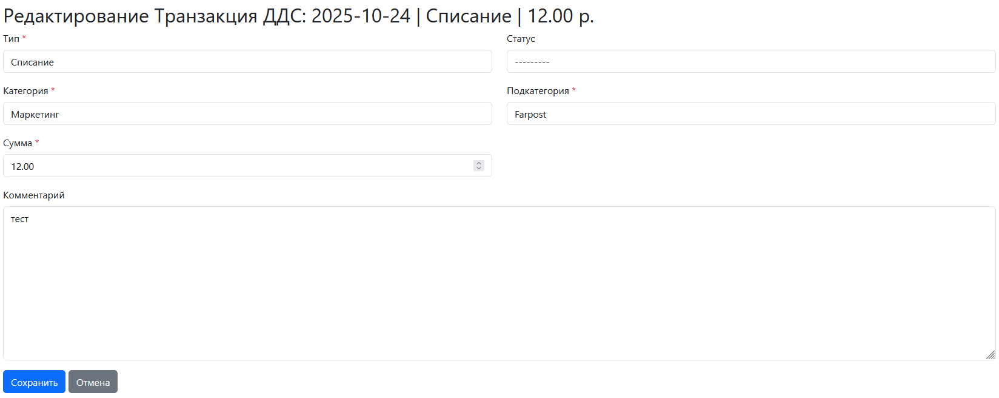

# Тестовое задание: Веб-сервис для управления движением денежных средств (ДДС)

### 1. *Управление записями:*


### 2. *Создание записи:*


### 3. *Редактирование записи:*



### 4. *Удаление записи:*


### 5. *Управление справочниками:*


### 6. *Изменение/Добавление статуса, типа, категории, подкатегории:*


### 7. *Удаление статуса, типа, категории, подкатегории:*


 
## Стек технологий

- ### *Python*

- ### *Django*

- ### *SQLite*

- ### *HTML + CSS + Bootstrap*

- ### *JavaScript*

## Установка:

### 1. Клонирование репозитория:

```
git clone https://github.com/John-1-1-1/my-dds-service
```

### 2.Переход в рабочую дирректорию:

```
cd my-dds-service
```

### 3. Создание виртуального окружения:

```
python -m venv venv
venv\Scripts\activate
pip install -r requirements.txt
```
### 4. Применение миграции:
```
python manage.py migrate
```

### 5. Запуск сервера:
```
python manage.py runserver
```

Главная страница: http://127.0.0.1:8000/